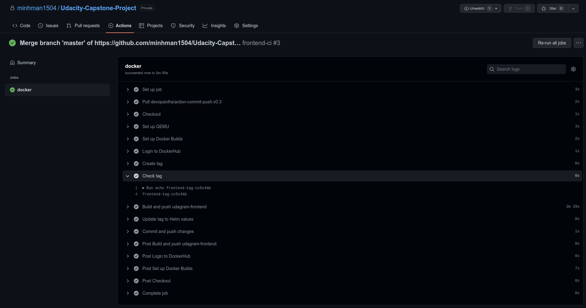
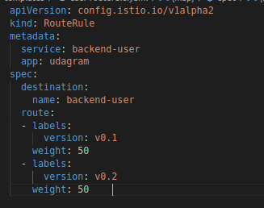

# Udacity Cloud Capstone Project - Microservice

## CICD Architecture


## Prerequisites
    - AWS Account, Github Account, Dockerhub Account
    - kubectl, eksctl, awscli

# Implementation
## 1. Push example code to SourceCode-Repo
```
git init
git add .
git commit -m "your-message"
git remote add origin https://github.com/minhman1504/Udacity-Capstone-Project-SourceCode.git
git push -u origin master
```
- Note: Github store AWS Credential then **cannot public**

## 2. Setup Github Actions
In Github SourceCode-Repo -> click **Actions** -> **Setup a workflow yourself** -> Create & Modify file **.github/workflows/ci.yml**

***Create some ci file for build image, push image to Dockerhub and update Helm value*** 

Follow: .github/workflows/*

-> Setup Secret \
-> save. Then push code from local to check workload and dockerhub 

## 3. Create eks cluster in AWS
Using AWS (Accesskey & Secretkey) to connect to AWS by awscli
```
aws configure
```
Now create cluster (default EC2 type: m5.large)
```
eksctl create cluster --name myCluster --region=us-east-1 --nodes-min=1 --nodes-max=2
```
Then, update config to use kubectl
```
aws eks update-kubeconfig --region us-east-1 --name myCluster
```

## 4. Install ArgoCD in Cluster

```
kubectl create namespace argocd
kubectl apply -n argocd -f https://raw.githubusercontent.com/argoproj/argo-cd/stable/manifests/install.yaml


kubectl patch svc argocd-server -n argocd -p '{"spec": {"type": "LoadBalancer"}}'

export ARGOCD_SERVER=`kubectl get svc argocd-server -n argocd -o json | jq --raw-output '.status.loadBalancer.ingress[0].hostname'`

export ARGO_PWD=`kubectl -n argocd get secret argocd-initial-admin-secret -o jsonpath="{.data.password}" | base64 -d`
```
In browser, access to server URL:
login by: \
username: admin \
password: $ARGO_PWD 

## 5. Config ArgoCD to deploy follow helm folder in github repo
In ArgoCD Web UI after login: **New App**


Click **CREATE**


Check using kubectl 


Test backend api


Test frontend

Frontend error because old "api-host" need to update (the first deploy, argocd apply all resource)

Change api-host in environment of frontend code and commit, Github Actions will rebuild Image and Push to Docker hub and Update Helm value, ArgoCD will be triggered and apply frontend with new tag.

Rebuild frontend automatically



tag was updated and apply


## Dockerhub

SourceCode use from project 3


## Rolling Update Deployment
- Because application using Deployment to deploy so that when apply new version, the ReplicaSet and Pod will create. If It health check oke, old version deployment will delete
- Because application using ArgoCD to CD and ArgoCD support Rollback version without downtime very easy.
- In backend-feel-deployment using Strategy RollingUpdate \


## A/B Deployment
write 2 deployment for 2 version of service. For example, I use backend-user-deployment for run 2 version (but code insight is same version, I change meta data for test) \


Create file RouteRule -> define traffic flow to 2 version. \



## Monitoring
Because use AWS EKS, then use AWS Cloudwatch to monitoring.
Follow AWS Document: https://docs.aws.amazon.com/AmazonCloudWatch/latest/monitoring/Container-Insights-setup-EKS-quickstart.html


ArgoCD Web can view pod logs

</br>
</br>
</br>

# Remove Resource and Delete Cluster

In ArgoCD Web UI Delete Application

```
# To remove ArgoCD 
kubectl delete -n argocd -f https://raw.githubusercontent.com/argoproj/argo-cd/stable/manifests/install.yaml
```

*Note: delete all server loadbalancer before delete cluster to avoid error ENI
```
eksctl delete cluster --name myCluster --region us-east-1
```
eksctl create cluster --name=cluster-1 --region us-east-1 --nodes=2
